# Database QA Automation Test Suite

> A comprehensive automated testing framework demonstrating professional database quality assurance practices with production-grade encryption.
[](https://www.python.org/downloads/)
[](https://www.postgresql.org/)
[](https://www.mysql.com/)
[](https://pytest.org/)
[](https://www.docker.com/)
[](https://redis.io/)
[](https://en.wikipedia.org/wiki/Galois/Counter_Mode)
[](https://www.postgresql.org/docs/current/sql-explain.html)
[](database-tests-map.py)
[](docs/TEST_CASES.md)

## 🎯 Overview

This project showcases enterprise-level database testing capabilities, including CRUD validation, data integrity checks, performance benchmarking, schema migrations, and AES-256-GCM encryption testing. Built with Python, Docker, and pytest, it demonstrates real-world QA engineering skills for database-driven applications.

---
### 📊 Architecture Overview


## ✨ Key Features

### 🔐 Security & Encryption
- **AES-256-GCM** authenticated encryption implementation
- **Key isolation** validation and tampering detection
- **Nonce uniqueness** verification across operations

### 🗄️ Database Testing
- **Multi-database support** - PostgreSQL & MySQL
- **CRUD operations** validation with transaction handling
- **Data integrity** testing (constraints, foreign keys, concurrency)
- **Schema validation** and migration testing

### ⚡ Performance & Optimization
- **Bulk operation** benchmarks (10,000+ records)
- **Query optimization** testing with indexes
- **Response time** validation (<100ms for indexed queries)

### 🛠️ Professional Tooling
- **Docker containerization** for consistent environments
- **Automated test reporting** (HTML & Allure)
- **Code coverage** analysis
- **Database inspection** utilities

---

## 📁 Project Structure

```bash
database-qa-automation/
│
├── 📂 framework/                    # Core testing framework
│   ├── __init__.py                 # Package initialization
│   ├── base_test.py                # Base test class with setup/teardown
│   └── db_manager.py               # Database connection manager
│
├── 📂 tests/                        # Test suite (24 test cases)
│   ├── sql/                        # SQL operations (8 tests)
│   │   ├── test_crud.py           # CRUD tests (SQL-001, 002, 003)
│   │   └── test_vault.py          # Vault & encryption (SQL-004 to 008)
│   ├── integrity/                 # Data integrity (3 tests)
│   │   └── test_data_integrity.py
│   ├── performance/               # Performance benchmarks (3 tests)
│   │   └── test_performance.py    # PERF-001, 002, 003 with EXPLAIN ANALYZE
│   ├── migrations/                # Schema validation (3 tests)
│   │   └── test_schema.py
│   ├── api/                       # API backend (3 tests)
│   │   └── test_backend_api.py
│   └── commander_cli/             # CLI operations (4 tests)
│       └── test_cli_commands.py
│
├── 📂 docs/                        # Documentation
│   ├── TEST_PLAN.md               # Comprehensive test strategy
│   ├── TEST_CASES.md              # Detailed test specifications (24 tests)
│   ├── PERFORMANCE_TESTING_GUIDE.md # EXPLAIN ANALYZE & performance testing
│   └── blog_post.md               # Technical deep-dive
│
├── 📄 docker-compose.yml           # PostgreSQL, MySQL, Redis services
├── 📄 setup_db.py                 # Database initialization with pgcrypto
├── 📄 inspect_db.py               # Database inspection utility
├── 📄 database-tests-map.py       # Test visualization generator
├── 📄 requirements.txt            # Python dependencies
├── 📄 .env                        # Environment configuration (git ignored)
├── 📄 .gitignore                  # Git ignore rules
├── 📄 README.md                   # Project documentation
└── 📄 LICENSE                     # MIT License
```
### 🚀 Quick Start
Prerequisites
Ensure you have the following installed:

Python 3.9-3.12 (⚠️ Python 3.13 not yet supported by psycopg2-binary)
Docker Desktop
Git

### Installation Steps
## 1️⃣ Clone & Navigate
```bash
git clone https://github.com/YOUR_USERNAME/database-qa-automation.git
cd database-qa-automation
```
## 2️⃣ Create Environment Variables

Create a .env file in the project root with the following content:
```bash
# PostgreSQL Configuration
POSTGRES_HOST=localhost
POSTGRES_PORT=5432
POSTGRES_DB=vault_db
POSTGRES_USER=vault_admin
POSTGRES_PASSWORD=secure_password_123
POSTGRES_ADMIN_USER=YOUR_USENAME

# MySQL Configuration
MYSQL_HOST=localhost
MYSQL_PORT=3306
MYSQL_DB=vault_db
MYSQL_USER=vault_admin
MYSQL_PASSWORD=secure_password_123
```
## 3️⃣ Setup Virtual Environment
``` bash
python3 -m venv venv
source venv/bin/activate  # Windows: venv\Scripts\activate
```
## 4️⃣ Install Dependencies
``` bash
pip install -r requirements.txt
```
## 5️⃣ Start Docker Containers
``` bash
docker-compose up -d
```
## 6️⃣ Initialize Databases
``` bash
python setup_db.py
```
## 7️⃣ Run Tests
``` bash
pytest tests/ -v
```
### 🧪 Test Execution Flow

```mermaid
graph TD
    A["pytest tests/"] --> B{Test Category}

    B -->|SQL| C1["8 SQL Tests<br/>CRUD & Encryption"]
    C1 --> C2["DB Setup"]
    C2 --> C3["Execute Queries"]
    C3 --> C4["Validate Results"]
    C4 --> C5["Encryption Checks"]
    C5 --> R1
    C5 --> R2

    B -->|Data Integrity| D1["3 Integrity Tests"]
    D1 --> D2["Setup Constraints"]
    D2 --> D3["Insert/Update/Delete"]
    D3 --> D4["Check FKs & Constraints"]
    D4 --> R1
    D4 --> R2

    B -->|Performance| E1["3 Performance Tests"]
    E1 --> E2["Bulk Insert/Query"]
    E2 --> E3["EXPLAIN ANALYZE"]
    E3 --> E4["Benchmark Timing"]
    E4 --> R1
    E4 --> R2
    E4 --> E5["Performance Report"]

    B -->|Schema| F1["3 Migration Tests"]
    F1 --> F2["Apply Migrations"]
    F2 --> F3["Validate Schema"]
    F3 --> F4["Check Indexes"]
    F4 --> R1
    F4 --> R2

    B -->|API| G1["3 API Tests"]
    G1 --> G2["Start API Server"]
    G2 --> G3["Send REST Requests"]
    G3 --> G4["Validate Responses"]
    G4 --> R1
    G4 --> R2

    B -->|CLI| H1["4 CLI Tests"]
    H1 --> H2["Invoke CLI Commands"]
    H2 --> H3["Check Output/DB State"]
    H3 --> R1
    H3 --> R2

    R1["✅ HTML Report"]
    R2["Coverage %"]
    E5["Performance Report"]

    style E5 fill:#e3f2fd,stroke:#1976d2,stroke-width:2px
    style R1 fill:#e1f5e1,stroke:#388e3c,stroke-width:2px
    style R2 fill:#fffde7,stroke:#fbc02d,stroke-width:2px
```

### 🧪 Test Execution
Run All Tests
```bash
pytest tests/ -v
```
Run Specific Test Module
```bash
pytest tests/sql/ -v              # SQL operations
pytest tests/integrity/ -v        # Data integrity
pytest tests/performance/ -v      # Performance benchmarks
```
Run Specific Test File
```bash
pytest tests/sql/test_crud.py -v  # CRUD tests
```
### 📊 Test Reports
``` bash
# HTML Report
pytest tests/ -v --html=report.html --self-contained-html

# Coverage Report
pytest tests/ --cov=framework --cov-report=html

# Allure Report
pytest tests/ --alluredir=allure-results
allure serve allure-results
```

### 📊 Test Coverage

| Category | Test Count | Description |
|----------|------------|-------------|
| **SQL Operations** | 8 | CRUD + AES-256-GCM encryption |
| **Data Integrity** | 3 | Constraints, FKs, concurrent access |
| **Performance** | 3 | Bulk ops & query optimization |
| **Schema/Migrations** | 3 | Structure, indexes, ALTER ops |
| **API Backend** | 3 | Data flow & error handling |
| **CLI Commands** | 4 | Export, delete, stats, queries |
| **Total** | **24** | **Comprehensive coverage** |


### 🔐 Encryption Implementation
AES-256-GCM Specifications
``` bash
Algorithm:     AES-256-GCM (Galois/Counter Mode)
Key Size:      256 bits (32 bytes)
Nonce:         96 bits (12 bytes) - unique per operation
Mode:          Authenticated Encryption with Associated Data (AEAD)
Storage:       Hex-encoded with prepended nonce
```
### 🔐 Encryption Data Flow

Security Validations
``` bash
✅ Key Isolation - Data encrypted with one key cannot be decrypted with another
✅ Tampering Detection - Modified ciphertext fails authentication
✅ Nonce Uniqueness - Each encryption uses a unique nonce
✅ Metadata Tracking - Encryption algorithm, timestamp, key ID stored
```
### 🗄️ Database Schema
vault_users Table
``` sql
CREATE TABLE vault_users (
    id SERIAL PRIMARY KEY,
    username VARCHAR(100) UNIQUE NOT NULL,
    email VARCHAR(255) UNIQUE NOT NULL,
    created_at TIMESTAMP DEFAULT CURRENT_TIMESTAMP
);
```
vault_data Table
``` sql
CREATE TABLE vault_records (
    id SERIAL PRIMARY KEY,
    user_id INTEGER REFERENCES vault_users(id) ON DELETE CASCADE,
    title VARCHAR(200) NOT NULL,
    encrypted_data TEXT NOT NULL,
    encryption_metadata JSONB,
    created_at TIMESTAMP DEFAULT CURRENT_TIMESTAMP,
    updated_at TIMESTAMP DEFAULT CURRENT_TIMESTAMP
);
``` 

### 🛠️ Technology Stack
``` table

Component	Technology
Language	Python 3.9-3.12
Test Framework	pytest, unittest
Databases	PostgreSQL 15, MySQL 8.0
Caching	Redis 7
Encryption	AES-256-GCM (cryptography library)
Containerization	Docker, docker-compose
DB Drivers	psycopg2-binary, PyMySQL
Reporting	pytest-html, allure-pytest
Benchmarking	pytest-benchmark
Utilities	python-dotenv, Faker, coverage
```
### 📈 Performance Benchmarks
``` table
Benchmark	Threshold	Validates
Bulk Insert	< 5 seconds	10,000 record insertion performance
Indexed Query	< 100ms	Query optimization with proper indexing
Query Plan Analysis	EXPLAIN ANALYZE JSON	Index utilization, execution time, buffer efficiency
```
### 📊 Query Optimization Analysis

#### EXPLAIN ANALYZE with JSON Format
The performance tests use PostgreSQL's `EXPLAIN ANALYZE` with JSON output to validate query optimization:

```sql
EXPLAIN (ANALYZE, BUFFERS, FORMAT JSON) 
SELECT * FROM vault_records WHERE user_id = %s
```
Query Plan Analysis Validates:

✅ Index utilization (Seq Scan vs Index Scan)
✅ Execution time (actual vs planned)
✅ Buffer usage and cache efficiency
✅ Row filtering effectiveness
✅ Query optimization success
Example Output Structure:
```sql
{
  "Plan": {
    "Node Type": "Index Scan",
    "Index Name": "idx_user_id",
    "Rows Removed by Filter": 0,
    "Planning Time": 0.125,
    "Execution Time": 15.432,
    "Actual Rows": 50,
    "Buffer Hits": 9950,
    "Buffer Reads": 50
  }
}
```
Performance Criteria:

Index Scan confirmed (not Seq Scan)
Execution time < 50ms
Minimal buffer misses
Accurate row estimates

### 🔍 Database Inspection
View Current State
``` python
python inspect_db.py
```
Direct PostgreSQL Access
``` bash
docker exec -it vault-postgres psql -U vault_admin -d vault_db
```
Query Examples
``` sql
SELECT * FROM vault_users;
SELECT * FROM vault_records;
SELECT COUNT(*) FROM vault_records WHERE user_id = 1;
```
Debug Test Output
``` bash
pytest tests/ -v -s  # -s flag shows print statements
```
### 🔧 Troubleshooting
## Error: "role vault_admin does not exist"
This means the PostgreSQL user wasn't created. Reset your Docker volumes:

``` bash
docker-compose down -v
docker-compose up -d
# Wait 10-15 seconds for initialization
python setup_db.py
```
## Python 3.13 compatibility
If you see build errors with psycopg2-binary, you may be using Python 3.13 which is not yet supported. Use Python 3.9-3.12 instead.

### 🧹 Cleanup & Maintenance
Stop Container
``` bash
docker-compose down
```
Remove All Data (Reset)
``` bash
docker-compose down -v
```
Restart Fresh
``` bash
docker-compose down -v
docker-compose up -d
# Wait 10-15 seconds
python setup_db.py
```
### 📝 Development Notes
## Adding New Tests

Create test file in appropriate category folder
Inherit from BaseTest class
Follow naming convention: test_{category}_{id}_{description}
Add test ID and structured docstring
Update TEST_CASES.md documentation

## Environment Configuration
The .env file stores sensitive configuration. Never commit this file to version control (it's in .gitignore).

### 📚 Documentation
TEST_PLAN.md - Comprehensive test strategy & scope
TEST_CASES.md - Detailed test specifications with IDs
PERFORMANCE_TESTING_GUIDE.md - Explains how PostgreSQL's `EXPLAIN ANALYZE` feature is used to inspect query execution plans, validate index usage, measure true database execution time, and detect performance regressions.

---

📝 License
This project is licensed under the MIT License - see the LICENSE file for details.

---

👤 Author
Carolina Steadham

GitHub: @steadhac
LinkedIn: Carolina Steadham
<div align="center">

⭐ Star this repo if you find it helpful!


</div>

🌟 Acknowledgments
Built as a comprehensive demonstration of professional database QA practices, showcasing:

Enterprise-level test automation
Production-grade security implementation
Performance optimization techniques
Docker containerization best practices
<div align="center">

Built with Python and ❤️ for Database Quality Assurance Excellence

Report Bug · Request Feature

</div>
